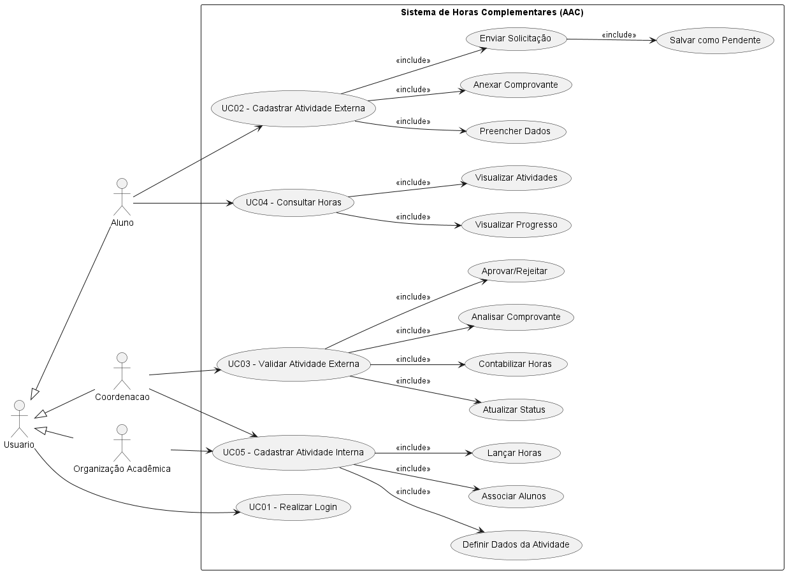

## Casos de Uso

#### UC01 – Realizar Login

Ator: Aluno/Coordenação/Organização Acadêmica

Descrição: Permite acesso ao sistema

Fluxo:

Usuário insere login e senha

Sistema valida credenciais

Sistema libera acesso

#### UC02 – Cadastrar Atividade Externa

Ator: Aluno

Fluxo:

Aluno acessa área de atividades

Preenche dados (tipo, carga horária, descrição)

Anexa comprovante

Envia solicitação

Sistema salva como “pendente”

#### UC03 – Validar Atividade Externa

Ator: Coordenação

Fluxo:

Admin acessa atividades pendentes

Analisa comprovante

Aprova ou rejeita

Sistema atualiza status

Sistema contabiliza horas (se aprovado)

#### UC04 – Consultar Horas

Ator: Aluno

Fluxo:

Aluno acessa dashboard

Sistema exibe:

Total de horas

Progresso

Lista de atividades

#### UC05 – Cadastrar Atividade Interna

Ator: Coordenação/Organização Acadêmica

Fluxo: Admin cria atividade

Admin cria atividade

Define carga horária

Associa alunos participantes

Sistema lança horas automaticamente

---

### Diagrama de Casos de Uso

Aqui está o diagrama de **Caso de Uso (UML)**:

