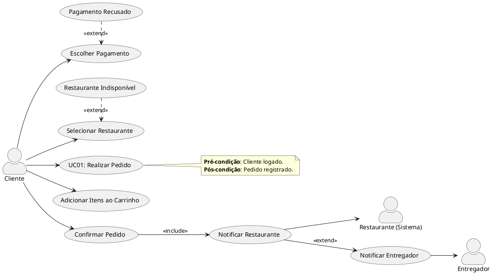
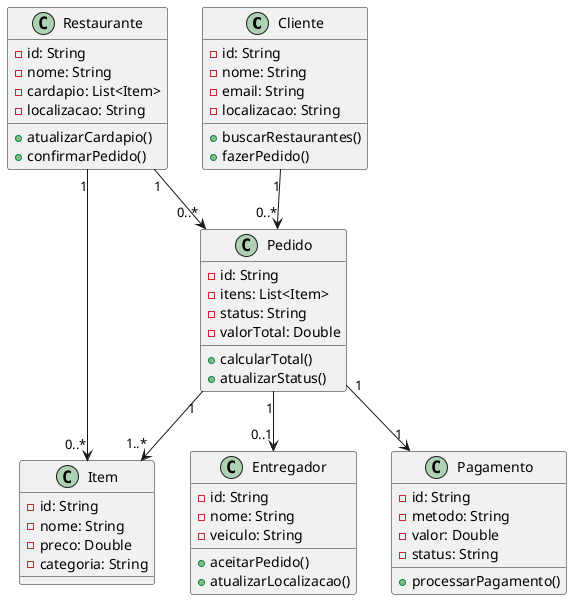

# **06 - Levantamento de Requisitos e Caso de Uso**

**Sistema:** XXXX*)

---

## **1. Identificação dos Stakeholders**

- **Aluno:** Aluno irá entrar e cadastrar sua atividade
- **Cordenação:** Irá avaliar e aprovar a atividade do aluno...
---

### **2. Requisitos Funcionais**

- **Cadastro de atividades externas**: O Sistema deve permitir que o aluno envie documentos para comprovar atividades fora da instituição.                         - **Cadastro de atividades internas**: O Sistema deve automaticamente identificar atividades internas.
- **Visualização de Horas** : O aluno deve ter acesso total à quantidade de horas registradas no total em atividades externas e internas.                          
- **Classificar atividades por tipo**: O Sistema deve categorizar as atividade em diferentes eixos (curso, palestra, evento, etc.)
- **Fazer login de alunos e coordenação** O sistema deve permitir o login de usuários
- **Visualização de atividades cadastradas**: O Aluno deve ter acesso total à visualização das atividades registradas
- 
### **3. Requisitos Não Funcionais**

- **Armazenamento de arquivos**: O Sistema deve possuir a capacidade de armazenar arquivos pdf, imágens, etc.
- **O sistema deve ser seguro, protegendo os dados dos alunos**: O Sistema deve garantir a segurança dos dados do usuário.
- **Sistema deve estar disponível 24 horas por dia**: O sistema deve estar disponível indefinidamente, com os servidores abertos.
- **Interface deve ser fácil de usar** O Sistema deve possúir boa usabilidade.

---

### **4. Exemplo de Caso de Uso** (Exemplo)

UC01 – Realizar Login

Ator: Aluno/Admin
Descrição: Permite acesso ao sistema

Fluxo:

Usuário insere login e senha
Sistema valida credenciais
Sistema libera acesso

UC02 – Cadastrar Atividade Externa

Ator: Aluno

Fluxo:

Aluno acessa área de atividades
Preenche dados (tipo, carga horária, descrição)
Anexa comprovante
Envia solicitação
Sistema salva como “pendente”

UC03 – Validar Atividade

Ator: Administrador

Fluxo:

Admin acessa atividades pendentes
Analisa comprovante
Aprova ou rejeita
Sistema atualiza status
Sistema contabiliza horas (se aprovado)

UC04 – Consultar Horas

Ator: Aluno

Fluxo:

Aluno acessa dashboard
Sistema exibe:
Total de horas
Progresso
Lista de atividades

UC05 – Cadastrar Atividade Interna

Ator: Administrador

Fluxo: Admin cria atividade

Admin cria atividade
Define carga horária
Associa alunos participantes
Sistema lança horas automaticamente
---


### Diagrama de Casos de Uso (Exemplo)

Aqui está o diagrama de **Caso de Uso (UML)** para o cenário de **"Realizar Pedido"** no aplicativo de delivery, usando **PlantUML**:

### **Código PlantUML**:


### **Explicação**:
1. **Atores**:
   - `Cliente`: Interage com o sistema para fazer pedidos.
   - `Restaurante` (Sistema): Recebe notificações de pedidos.
   - `Entregador`: Recebe alertas para coleta/entrega.

2. **Fluxo Principal** (dentro do caso de uso `UC01`):
   - Selecionar Restaurante → Adicionar Itens → Escolher Pagamento → Confirmar Pedido.

3. **Relacionamentos**:
   - `<<include>>`: "Confirmar Pedido" **requer** "Notificar Restaurante".
   - `<<extend>>`: Fluxos alternativos (pagamento recusado/restaurante indisponível).

4. **Notas**: Condições do cenário.

---

---

### **Código PlantUML (Salt)**

```plantuml
@startsalt
{
  {^
    <b>FastDelivery - Buscar Restaurantes</b>
  }
  {
    [🔍 Buscar...] | [Filtros ▼]
  }
  {
    (X) Restaurante A      | ⭐ 4.5
    () Restaurante B      | ⭐ 4.2
    () Restaurante C      | ⭐ 4.7
  }
  {
    [Ver Cardápio] | [Voltar]
  }
}

@startsalt
{
  {^
    <b>Restaurante A - Cardápio</b>
  }
  {
    (X) Pizza Margherita   | R$ 35.00
    () Hambúrguer Artesanal | R$ 28.00
    () Salada Caesar       | R$ 22.00
  }
  {
    [Adicionar ao Carrinho] | [Voltar]
  }
}

@startsalt
{
  {^
    <b>Carrinho de Compras</b>
  }
  {
    "Pizza Margherita"  | R$ 35.00
    "Hambúrguer"       | R$ 28.00
    "Taxa de Entrega"  | R$ 5.00
    --------------------------
    "Total"            | R$ 68.00
  }
  {
    [Continuar para Pagamento] | [Editar]
  }
}

@startsalt
{
  {^
    <b>Pagamento</b>
  }
  {
    () Cartão Crédito (•••• 1234)
    () PIX
    () Dinheiro na Entrega
  }
  {
    [Finalizar Pedido] | [Cancelar]
  }
}

@startsalt
{
  {^
    <b>Pedido Confirmado!</b>
  }
  {
    ! Pedido #1234 recebido!
    "Tempo estimado:" 30-40 min.
  }
  {
    [Acompanhar Pedido] | [Voltar ao Início]
  }
}
```


---

### **Telas Prototipadas (Fluxo do Caso de Uso)**  
1. **Buscar Restaurantes**:  
   - Barra de busca + filtros.  
   - Lista de restaurantes com seleção (radio buttons).  

2. **Cardápio do Restaurante**:  
   - Itens selecionáveis com preços.  
   - Botão para adicionar ao carrinho.  

3. **Carrinho**:  
   - Resumo dos itens + valor total.  
   - Ação para prosseguir ao pagamento.  

4. **Pagamento**:  
   - Opções de pagamento (cartão, PIX, dinheiro).  
   - Confirmação do pedido.  

5. **Confirmação**:  
   - Feedback de sucesso + tempo de entrega.  

---

### **Como Visualizar**  
- Cole o código em ferramentas como:  
  - [PlantText](https://www.planttext.com/) (suporte a Salt).  
  - VS Code com extensão **PlantUML**.  

---

### **Exemplo de Saída (Estilizada)**  
```
+------------------------------+
| FastDelivery - Buscar Restaur.|
+------------------------------+
| [🔍 Buscar...] | [Filtros ▼]  |
+------------------------------+
| (X) Restaurante A | ⭐ 4.5    |
| () Restaurante B  | ⭐ 4.2    |
+------------------------------+
| [Ver Cardápio] | [Voltar]    |
+------------------------------+
```

---

### **Personalização**  
- Para adicionar **mais telas** (ex.: login, acompanhamento de entrega):  
  ```plantuml
  @startsalt
  {
    {^ <b>Login</b> }
    {
      "E-mail:"   [               ]
      "Senha:"   [               ]
    }
    {
      [Entrar] | [Criar Conta]
    }
  }
  ```

  ---

  ### Diagrama de Classe

  Aqui está o **diagrama de classes conceitual** para o sistema de delivery, representando os principais conceitos e seus relacionamentos:

### Diagrama de Classes (PlantUML)



### Explicação:
1. **Classes Principais**:
   - **Cliente**: Realiza pedidos e busca restaurantes.
   - **Restaurante**: Oferece itens do cardápio e confirma pedidos.
   - **Pedido**: Agrupa itens, calcula total e rastreia status.
   - **Item**: Produtos individuais do cardápio.
   - **Entregador**: Responsável pela entrega.
   - **Pagamento**: Processa transações.

2. **Relacionamentos**:
   - Um cliente faz **0 ou N** pedidos.
   - Um pedido contém **1 ou N** itens.
   - Um restaurante tem **0 ou N** itens no cardápio.
   - Cada pedido tem **exatamente 1** pagamento.
   - Um pedido pode estar associado a **0 ou 1** entregador.

3. **Atributos e Métodos**:
   - Atributos privados (indicados por `-`) e métodos públicos (`+`).
   - Exemplo: `Pedido.calcularTotal()` soma os preços dos itens.

---


---

### Adaptações Possíveis:
1. **Adicionar Herança**:
   ```plantuml
   class Usuario {
     - id: String
     - nome: String
   }
   class Cliente {
     - localizacao: String
   }
   class Entregador {
     - veiculo: String
   }
   Usuario <|-- Cliente
   Usuario <|-- Entregador
   ```

2. **Incluir Enums** (ex.: status do pedido):
   ```plantuml
   enum StatusPedido {
     EM_PREPARO
     EM_TRANSITO
     ENTREGUE
   }
   class Pedido {
     - status: StatusPedido
   }
   ```

--- 
